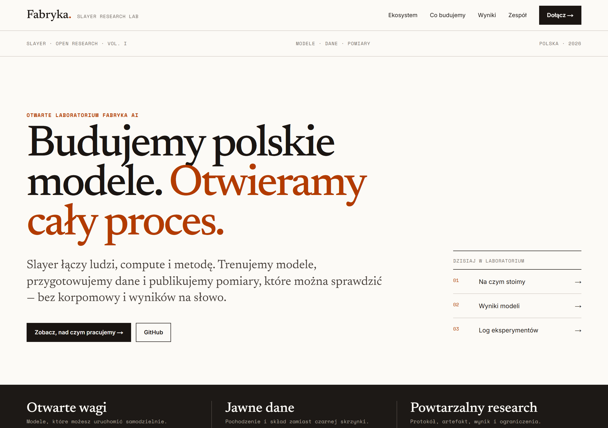
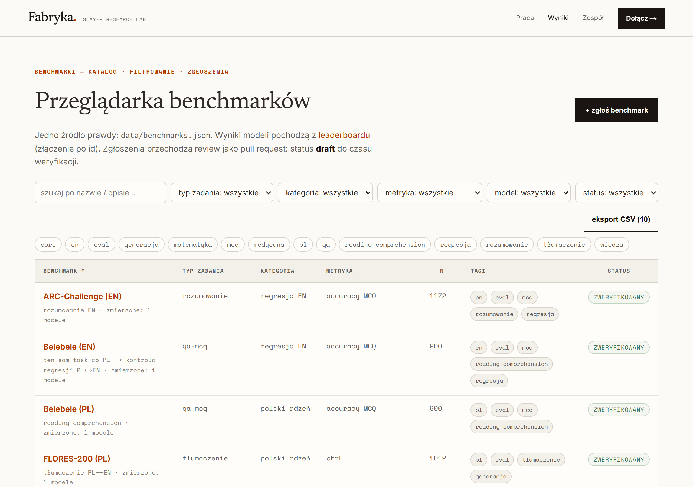
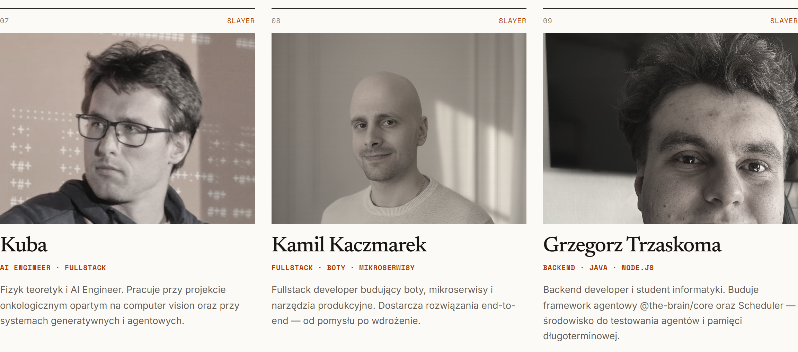

<p align="center"></p>

<h1 align="center">Slayer</h1>

<h3 align="center">An open Polish LLM lab: measuring Bielik and Qwen on Polish benchmarks, no benchmaxxing.</h3>

<p align="center">
  
  
  
  
  
</p>

---

## Table of contents

- [About the lab](#about-the-lab)
- [Screenshots](#screenshots)
- [Source code](#source-code)
- [Stack](#stack)
- [My role](#my-role)
- [Statistics](#statistics)
- [Contact](#contact)

---

## About the lab

Polish language models cannot be compared by gut feeling. Foreign benchmarks do not measure official and legal Polish, and results from papers are hard to reproduce. A team choosing a Polish model for a product has no credible, public point of reference.

Slayer is an open lab building exactly that. It measures Bielik-11B-v3 against Qwen3.5-9B on Polish exams and tasks: MCQ, PoQuAD, FLORES. The methodology is public: dataset decontamination, data cards, reproducible scripts. Results land on a live leaderboard at [slayer.fabryka.ai](https://slayer.fabryka.ai).

The lab is in the baseline phase and has made its call: Qwen is the base for further work. The next phases are cheap SFT/GRPO without full CPT. The code is public under the MIT license.

---

## Screenshots

| Leaderboard: Bielik-11B-v3 vs Qwen3.5-9B on Polish benchmarks | Per-task results in the bench explorer |
|:---:|:---:|
|  |  |

| The lab's team page: member since June 2026 |
|:---:|
|  |

> **Note:** frames from the lab's public pages (slayer.fabryka.ai), September 2026.

---

## Source code

The lab's code is open: [slayerlabs/slayer](https://github.com/slayerlabs/slayer) (MIT). This repo is a showcase of my contribution: description, frames, and a list of PRs.

---

## Stack

### Measurement harness

```
Python + pytest        // bench scripts: MCQ, PoQuAD, tokenizer fertility
Hugging Face datasets  // Global-MMLU PL, PoQuAD, FLORES
MinHash + diacritics   // decontamination: literal and near-dup layers
Ollama                 // local model runtime
```

### Lab site

```
Next.js + React        // leaderboard, bench explorer, progress
Vercel                 // hosting and analytics
```

---

## My role

The lab is led by [Kacper Wikieł](https://github.com/kwikiel): concept, ML, and infrastructure, most of the commits. I have been an organization member since June 2026. My contribution is 7 merged PRs, all around measurement cleanliness and reproducibility:

- **Near-dup decontamination layer** ([#29](https://github.com/slayerlabs/slayer/pull/29)) - the existing audit only caught literal contamination, word n-grams. My module catches copies stripped of Polish diacritics and lightly reworded items. CPU-only
- **Global-MMLU PL loader** ([#31](https://github.com/slayerlabs/slayer/pull/31)) - Polish MMLU as the `mmlu_pl` benchmark in the MCQ harness. Public dataset, deterministic test split
- **Evaluation guards** ([#60](https://github.com/slayerlabs/slayer/pull/60)) - the PoQuAD and tokenizer fertility scripts no longer crash on empty results. A degenerate score no longer wins the tokenizer table
- **Path reproducibility** ([#86](https://github.com/slayerlabs/slayer/pull/86)) - one `BENCH_OUT` variable instead of the author's hardcoded path in four scripts. The benchmark runs for everyone, not just its creator
- **Security patches** ([#32](https://github.com/slayerlabs/slayer/pull/32), [#87](https://github.com/slayerlabs/slayer/pull/87)) - postcss (CVE-2026-41305) and undici (4 Dependabot alerts, including a WebSocket DoS)
- **Navigation fixes** ([#61](https://github.com/slayerlabs/slayer/pull/61)) - active state of nested menu items, external links opening in a new tab

What I did not do: model training and the lab's frontend. My PRs keep the measurement clean and reproducible.

---

## Statistics

### My contribution

| Metric | Value |
|---|---|
| **Merged PRs** | 7 (one day of work, 2026-06-28) |
| **Areas** | decontamination, loaders, evaluation guards, repro, security |
| **CVE patches** | postcss (CVE-2026-41305), undici (4 Dependabot alerts) |
| **Organization member** | since June 2026 |

### Lab

| Metric | Value |
|---|---|
| **Baseline models** | Bielik-11B-v3, Qwen3.5-9B |
| **Benchmarks** | MCQ (mmlu_pl), PoQuAD, FLORES |
| **Phase** | baseline, next: SFT/GRPO on Qwen |
| **Lead** | [Kacper Wikieł](https://github.com/kwikiel) |

---

## Contact

| Platform | Link |
|---|---|
| **WWW** | [kamilkaczmareksolutions.com](https://kamilkaczmareksolutions.com) |
| **GitHub** | [kamilkaczmareksolutions](https://github.com/kamilkaczmareksolutions) |
| **LinkedIn** | [Kamil Kaczmarek](https://www.linkedin.com/in/kamilkaczmareksolutions) |
| **Email** | [recruitment@kamilkaczmareksolutions.com](mailto:recruitment@kamilkaczmareksolutions.com) |

---

**Slayer** - an open Polish LLM lab. Lab: [slayerlabs](https://github.com/slayerlabs).

<p align="center"><em>Commit-level contribution: <a href="https://github.com/kamilkaczmareksolutions">Kamil Kaczmarek</a>. Lab lead: <a href="https://github.com/kwikiel">Kacper Wikieł</a>.</em></p>
